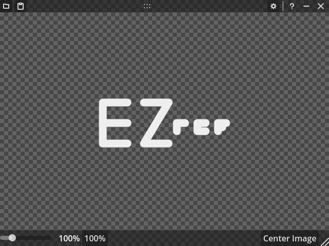

# EZRef

<picture>
  <source source="./splash.png" media="(prefers-color-scheme: dark)" />
  <source
    source="./.repo/logo_dark.png"
    media="(prefers-color-scheme: light)"
  />
  
</picture>

A simple, always-on-top window that displays reference images.

> [!NOTE]
> The `main` branch is the current, stable release. The `dev` branch is the main
> development branch.

## Download

[See the latest release in the repo's releases page.](https://github.com/ThEnderYoshi/ezref/releases/latest)

> [!NOTE]
> Currently only `Windows x86 64-bit` is pre-exported. If you need the tool
> exported to another target, you will have to manually do it yourself.

## Usage

If you hover the cursor over the window, two bars will appear with
some controls:

- `Open` (<kbd>Ctrl</kbd>+<kbd>O</kbd>): Brings up a file dialog to open an
  image from the file system.

- `Paste` (<kbd>Ctrl</kbd>+<kbd>V</kbd>): If you have an image on your
  clipboard, it will be pasted into the window.

  > [CAUTION!]
  > Trying to paste an image copied from a selection in Krita will crash the
  > program. I have no idea how to fix this.

- `Settings`: Brings up the display settings window. It contains the following:
  - `Filter`: Allows you to determine the filter used to scale the image.
    Currently supports `Linear` (blurry) and `Nearest Neighbor` (pixel-y).
  - `Background`: Changes the background texture between `Checkered` (light or
    dark) and `Transparent`.

- The slider on the bottom (also controllable with the scroll wheel or
  <kbd>Ctrl</kbd>+<kbd>=</kbd>/<kbd>Ctrl</kbd>+<kbd>-</kbd>) can be used to zoom
  in and out.

- The `100%` button (<kbd>Ctrl</kbd>+<kbd>0</kbd>) resets the zoom back to 100%.

Additionally, you can click + drag to pan the image. `Center Image` resets
the panning.
